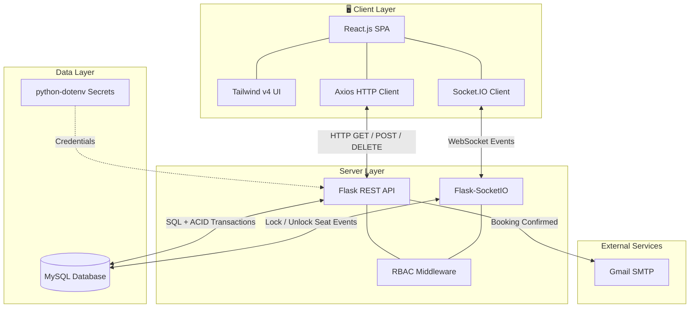
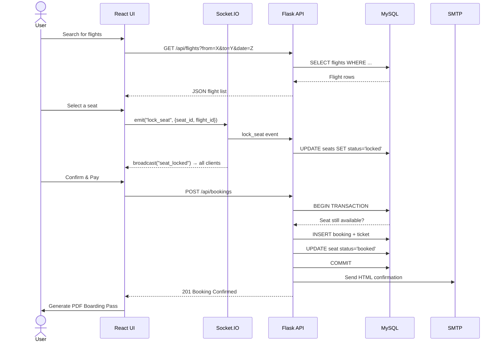
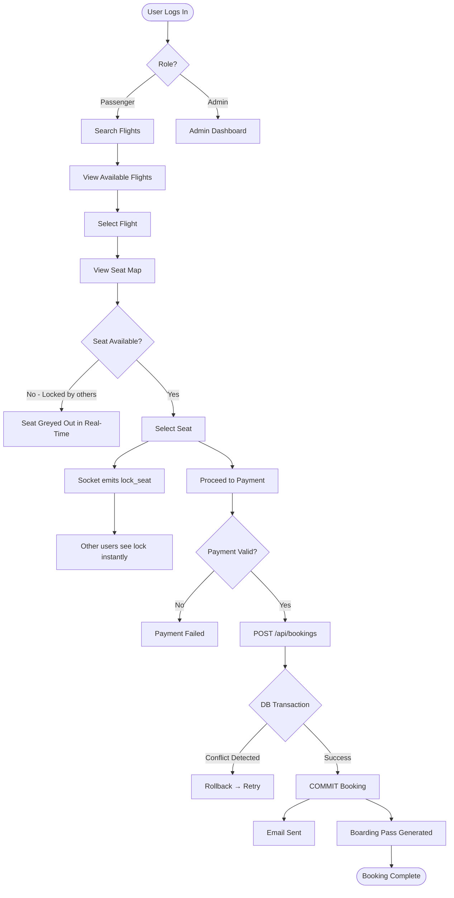
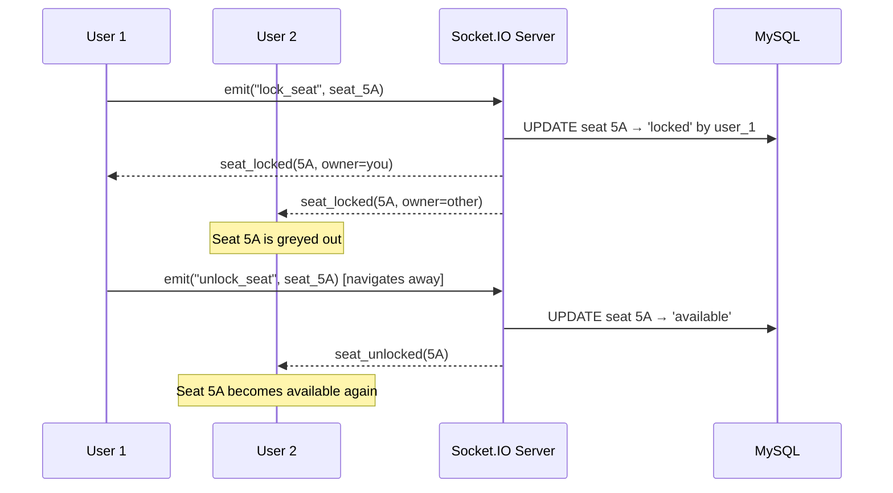
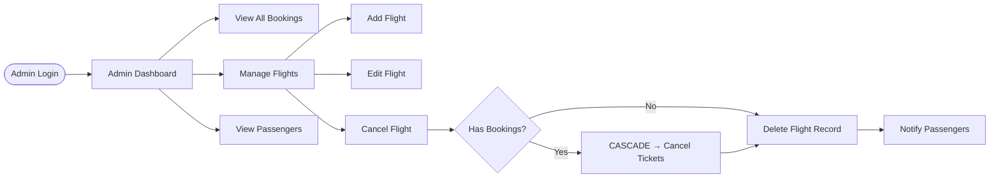
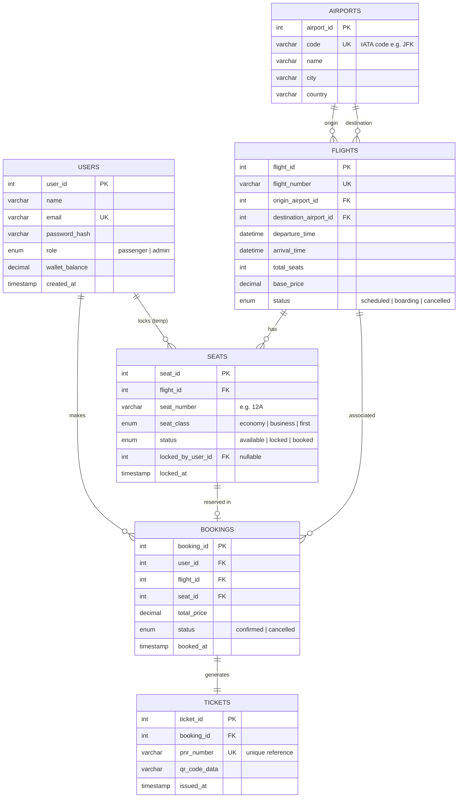

# ✈️ Next-Gen Flight Reservation & Management System


> A full-stack, real-time web application engineered to simulate a modern airline booking platform. Built with a focus on **concurrency handling, database referential integrity, and seamless UI/UX**.


---

## 📑 Table of Contents

- [Key Features](#-key-architectural-features)
- [System Architecture](#-system-architecture)
- [Data Flow Diagrams](#-data-flow-diagrams)
- [Database Schema](#-database-schema)
- [API Reference](#-api-reference)
- [Tech Stack](#-tech-stack)
- [Local Setup](#-local-development-setup)
- [Folder Structure](#-folder-structure)
- [Author](#-author)

---

## 🚀 Key Architectural Features

| Feature | Description |
|---|---|
|  **Real-Time WebSockets** | Solves the classic double-booking race condition. Seat selections lock globally across all sessions via `Flask-SocketIO` — no page reload needed. |
|  **ACID Transactions** | MySQL transactional wrappers (Commit/Rollback) with `ON DELETE CASCADE` foreign keys guarantee full data integrity during bookings and cancellations. |
|  **Client-Side PDF** | Boarding passes with embedded QR codes are generated entirely on the client using `html-to-image` + `jsPDF`, eliminating server rendering overhead. |
|  **Automated SMTP** | HTML-formatted booking confirmation emails dispatched via Python `smtplib`, secured with `.env`-managed App Passwords. |
|  **RBAC Auth** | Distinct flows for **Passengers** (Travel Wallet, Boarding Passes) and **Admins** (Global Booking Overviews, Flight Management). |

---

## 🏗️ System Architecture

### High-Level Architecture



### Component Interaction Diagram



---

## 🔄 Data Flow Diagrams

### Booking Flow



### Real-Time Seat Locking Flow



### Admin Flow



---

## 🗄️ Database Schema

### Entity Relationship Diagram



### Database Table Definitions (MySQL)

```sql
-- Users table with wallet support
CREATE TABLE users (
    user_id        INT AUTO_INCREMENT PRIMARY KEY,
    name           VARCHAR(100)   NOT NULL,
    email          VARCHAR(150)   NOT NULL UNIQUE,
    password_hash  VARCHAR(255)   NOT NULL,
    role           ENUM('passenger','admin') DEFAULT 'passenger',
    wallet_balance DECIMAL(10,2)  DEFAULT 0.00,
    created_at     TIMESTAMP      DEFAULT CURRENT_TIMESTAMP
);

-- Airport master data
CREATE TABLE airports (
    airport_id INT AUTO_INCREMENT PRIMARY KEY,
    code       VARCHAR(10)  NOT NULL UNIQUE,  -- IATA e.g. 'JFK'
    name       VARCHAR(150) NOT NULL,
    city       VARCHAR(100) NOT NULL,
    country    VARCHAR(100) NOT NULL
);

-- Flights with origin/destination FK
CREATE TABLE flights (
    flight_id             INT AUTO_INCREMENT PRIMARY KEY,
    flight_number         VARCHAR(20)   NOT NULL UNIQUE,
    origin_airport_id     INT           NOT NULL,
    destination_airport_id INT          NOT NULL,
    departure_time        DATETIME      NOT NULL,
    arrival_time          DATETIME      NOT NULL,
    total_seats           INT           NOT NULL,
    base_price            DECIMAL(10,2) NOT NULL,
    status                ENUM('scheduled','boarding','cancelled') DEFAULT 'scheduled',
    FOREIGN KEY (origin_airport_id)      REFERENCES airports(airport_id),
    FOREIGN KEY (destination_airport_id) REFERENCES airports(airport_id)
);

-- Seats with real-time lock tracking
CREATE TABLE seats (
    seat_id          INT AUTO_INCREMENT PRIMARY KEY,
    flight_id        INT          NOT NULL,
    seat_number      VARCHAR(5)   NOT NULL,  -- e.g. '12A'
    seat_class       ENUM('economy','business','first') DEFAULT 'economy',
    status           ENUM('available','locked','booked')  DEFAULT 'available',
    locked_by_user_id INT         NULL,
    locked_at        TIMESTAMP    NULL,
    FOREIGN KEY (flight_id)         REFERENCES flights(flight_id) ON DELETE CASCADE,
    FOREIGN KEY (locked_by_user_id) REFERENCES users(user_id)
);

-- Bookings with ACID integrity
CREATE TABLE bookings (
    booking_id  INT AUTO_INCREMENT PRIMARY KEY,
    user_id     INT            NOT NULL,
    flight_id   INT            NOT NULL,
    seat_id     INT            NOT NULL,
    total_price DECIMAL(10,2)  NOT NULL,
    status      ENUM('confirmed','cancelled') DEFAULT 'confirmed',
    booked_at   TIMESTAMP      DEFAULT CURRENT_TIMESTAMP,
    FOREIGN KEY (user_id)   REFERENCES users(user_id),
    FOREIGN KEY (flight_id) REFERENCES flights(flight_id) ON DELETE CASCADE,
    FOREIGN KEY (seat_id)   REFERENCES seats(seat_id)
);

-- Tickets / boarding passes
CREATE TABLE tickets (
    ticket_id    INT AUTO_INCREMENT PRIMARY KEY,
    booking_id   INT          NOT NULL UNIQUE,
    pnr_number   VARCHAR(10)  NOT NULL UNIQUE,
    qr_code_data TEXT,
    issued_at    TIMESTAMP    DEFAULT CURRENT_TIMESTAMP,
    FOREIGN KEY (booking_id) REFERENCES bookings(booking_id) ON DELETE CASCADE
);
```

---

## 📡 API Reference

### Authentication

| Method | Endpoint | Description | Auth |
|--------|----------|-------------|------|
| `POST` | `/api/auth/register` | Register new passenger | Public |
| `POST` | `/api/auth/login` | Login → returns session token | Public |
| `POST` | `/api/auth/logout` | Invalidate session | Required |

### Flights

| Method | Endpoint | Description | Auth |
|--------|----------|-------------|------|
| `GET` | `/api/flights` | Search flights by origin, destination, date | Public |
| `GET` | `/api/flights/:id` | Get flight details + seat map | Public |
| `POST` | `/api/flights` | Create new flight | Admin |
| `PUT` | `/api/flights/:id` | Update flight info | Admin |
| `DELETE` | `/api/flights/:id` | Cancel flight (cascades to bookings) | Admin |

### Bookings

| Method | Endpoint | Description | Auth |
|--------|----------|-------------|------|
| `POST` | `/api/bookings` | Create booking (ACID transaction) | Passenger |
| `GET` | `/api/bookings/me` | Get own bookings + tickets | Passenger |
| `GET` | `/api/bookings` | Get all bookings (global view) | Admin |
| `DELETE` | `/api/bookings/:id` | Cancel booking + refund wallet | Passenger |

### Wallet

| Method | Endpoint | Description | Auth |
|--------|----------|-------------|------|
| `GET` | `/api/wallet` | Get wallet balance | Passenger |
| `POST` | `/api/wallet/topup` | Add funds to wallet | Passenger |

### Socket.IO Events

| Direction | Event | Payload | Description |
|-----------|-------|---------|-------------|
| Client → Server | `lock_seat` | `{seat_id, flight_id}` | Temporarily lock seat |
| Client → Server | `unlock_seat` | `{seat_id, flight_id}` | Release seat lock |
| Server → All | `seat_locked` | `{seat_id, user_id}` | Broadcast lock to all clients |
| Server → All | `seat_unlocked` | `{seat_id}` | Broadcast unlock to all clients |
| Server → All | `seat_booked` | `{seat_id}` | Permanent booking broadcast |

---

## 💻 Tech Stack

### Frontend

| Technology | Purpose |
|---|---|
| React.js (Vite) | SPA framework, component architecture |
| React Router v6 | Client-side routing |
| Tailwind CSS v4 | Utility-first styling, Glassmorphism design |
| Axios | HTTP client for REST API calls |
| Socket.IO Client | Real-time WebSocket communication |
| qrcode.react | QR code generation for boarding passes |
| jsPDF + html-to-image | Client-side PDF boarding pass generation |

### Backend

| Technology | Purpose |
|---|---|
| Python Flask | REST API server |
| Flask-SocketIO | WebSocket event handling |
| mysql-connector-python | MySQL database driver |
| python-dotenv | Secure environment variable management |
| Flask-CORS | Cross-Origin Resource Sharing |
| smtplib | Email dispatch via Gmail SMTP |

### Database

| Technology | Purpose |
|---|---|
| MySQL | Relational data store |
| ACID Transactions | Booking integrity (Commit/Rollback) |
| Foreign Key Constraints | Referential integrity with ON DELETE CASCADE |

---

## ⚙️ Local Development Setup

### Prerequisites

- Node.js v18+
- Python 3.8+
- MySQL 8.0+ (local instance or Docker)

### 1. Database Configuration

```sql
-- Run in MySQL client or phpMyAdmin
CREATE DATABASE flight_booking_db CHARACTER SET utf8mb4 COLLATE utf8mb4_unicode_ci;
```

Then import the schema (paste or import the SQL from the [Database Schema](#-database-schema) section above).

### 2. Backend Setup

```bash
# Navigate to backend
cd Backend

# Create and activate virtual environment
python -m venv venv
source venv/bin/activate        # Linux/macOS
venv\Scripts\activate           # Windows

# Install dependencies from requirements.txt
pip install -r requirements.txt

# Or manually:
# pip install flask flask-cors flask-socketio mysql-connector-python python-dotenv
```

Create a `.env` file in `/Backend` (alongside `app.py` and `config.py`):

```env
DB_HOST=127.0.0.1
DB_USER=root
DB_PASSWORD=your_mysql_password
DB_NAME=flight_booking_db

SENDER_EMAIL=your_email@gmail.com
SENDER_PASSWORD=your_16_char_app_password
```

> ⚠️ Use a Gmail **App Password**, not your regular account password. Enable it at [myaccount.google.com/apppasswords](https://myaccount.google.com/apppasswords).

Start the server:

```bash
python app.py
# Flask + Socket.IO server runs on http://localhost:5000
```

### 3. Frontend Setup

```bash
# Open a new terminal
cd Frontend

# Install dependencies
npm install

# Start the Vite dev server
npm run dev
# App runs on http://localhost:5173
```

---

## 📁 Folder Structure

```
FLIGHT-RESERVATION-SYSTEM/
│
├── Backend/                          # Python Flask server
│   ├── __pycache__/                  # Python bytecode cache (auto-generated)
│   ├── routes/                       # All Flask route blueprints
│   │                    
│   ├── venv/                         # Python virtual environment (not committed)
│   ├── .env                          # 🔒 DB credentials & SMTP secrets
│   ├── app.py                        # Flask entry point, Socket.IO init, CORS
│   ├── config.py                     # DB connection config, app settings
│   └── requirements.txt              # Python dependencies
│
└── Frontend/                         # React + Vite client
    ├── node_modules/                 # npm packages (not committed)
    ├── public/                       # Static assets served as-is
    ├── src/                          # Application source
    │   ├── assets/                   # Images, fonts, static files
    │   ├── components/               # Reusable UI components
    │   │   └── Navbar.jsx            # Global navigation bar
    │   └── pages/                    # Route-level page components
    │       ├── Home.jsx              # Landing / search page
    │       ├── Login.jsx    # Flight listing
    │       ├── DashBoard.jsx           # Real-time interactive seat grid
    │       ├── Booking.jsx           # Payment & confirmation
    │       ├   # Passenger booking history
    │       ├   # PDF + QR boarding pass generator
           └── AdminDashboard.jsx    # Admin flight & booking management
    │ ├── App.css                   # Global styles
    │  ├── App.jsx                   # Root component, React Router setup
    │  ├── index.css                 # Tailwind base imports
    │  └── main.jsx                  # Vite entry point, ReactDOM.render
    ├── .gitignore                    # Ignores node_modules, .env, dist, etc.
    ├── eslint.config.js              # ESLint rules
    ├── index.html                    # Vite HTML shell
    ├── package-lock.json             # Locked dependency tree
    └── package.json                  # npm scripts & dependencies
```

---

## 🔐 Security Considerations

- All secrets stored in `.env` — never committed to version control
- Passwords stored as hashed values (bcrypt recommended)
- RBAC enforced server-side on every protected route
- MySQL prepared statements used throughout to prevent SQL injection
- CORS restricted to frontend origin only in production

---

## 🗺️ Roadmap

- [ ] OAuth2 / Google Sign-In
- [ ] Multi-leg flight booking support
- [ ] Admin analytics dashboard (revenue, occupancy charts)
- [ ] Mobile app (React Native)
- [ ] Containerization with Docker + docker-compose

---

## 👨‍💻 Author

**Allyan Khan**

BSc Computer Software Engineering @ UET Mardan


[](https://github.com/your-profile)

---

> Built as a comprehensive demonstration of full-stack engineering principles, API design, real-time distributed systems, and ACID-compliant database architecture.
